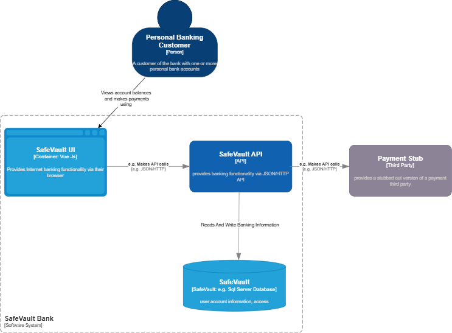
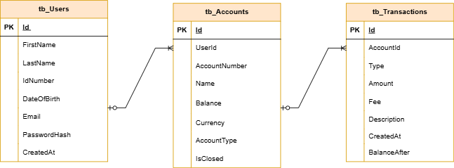
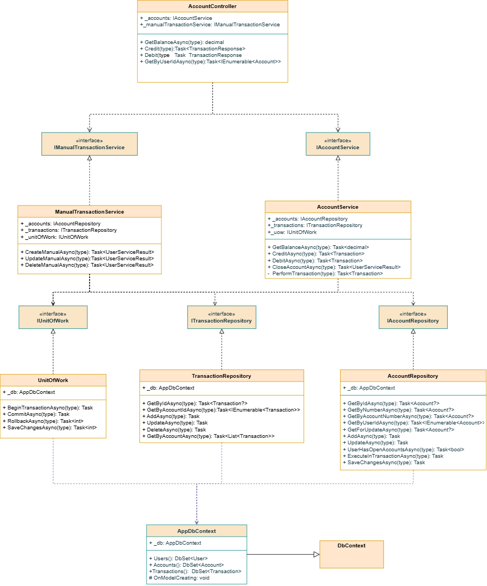
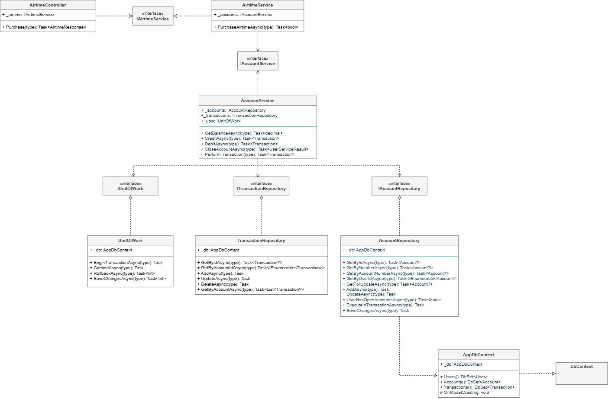
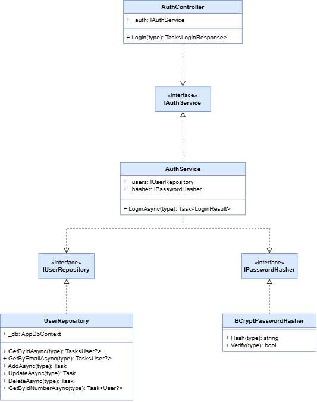
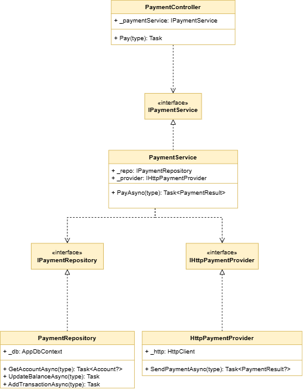
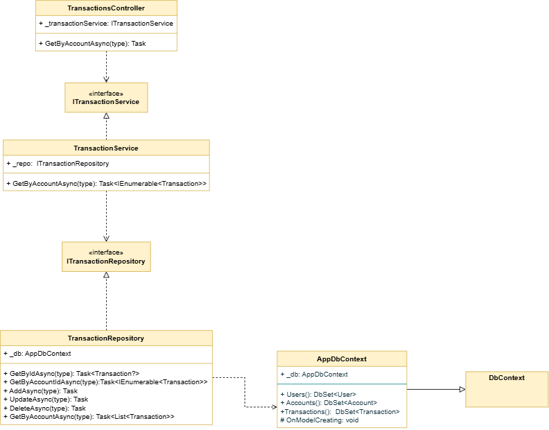

# 🔐 SafeVault API

## Overview

SafeVault is a modern digital banking Single Page Application that allows a user to view their accounts, perform transfers, purchase airtime, and review transaction history in a way that reflects how a real banking app (e.g., Standard Bank) behaves.

The backend in this repository is a **.NET (Clean Architecture) Web API** that:

- Exposes endpoints for **Users (Persons)**, **Accounts**, and **Transactions**
- Enforces the business rules from the assessment
- Integrates with a SQL Server database via **Entity Framework Core**
- Supports front-end flows for login, viewing accounts, transferring funds, buying airtime, and viewing transactions

The system closely follows the assessment brief (Persons, Accounts, Transactions), but applies **real-world banking constraints**:

- A user only sees and operates **their own** data  
- Accounts are **pre-provisioned** by the system (as banks do), not created ad hoc through the UI  
- Balances are **system-controlled** and updated only via transactions  
- All transactions are recorded and auditable

---

## How This Solution Covers the Assessment Requirements

SafeVault implements the “persons, accounts, and transactions” assessment brief in the context of a realistic digital banking application.

Instead of exposing a generic CRUD view over all persons and accounts, the system behaves like an actual banking app:

- The user logs in and operates only on **their own** data.
- Person details are available and editable through a **Profile** section in the UI.
- A **Home dashboard** shows all accounts belonging to the logged-in user, with options to transfer funds and perform payments.
- A **Transactions** view allows the user to inspect the history of each account.
- Airtime purchases and internal transfers are fully wired end-to-end, updating balances and recording transactions in the database.

All of this is backed by:

- A **Vue.js SPA** (in the UI repository)
- This **.NET Clean Architecture API**
- A **SQL Server** database with `User`, `Account`, and `Transaction` entities
- A **DB initializer** that pre-creates sample persons, accounts, and transactions as required by the assessment script

Where the original assessment describes “Persons List”, “Person Details”, “Account Details”, and “Transaction Details” pages, SafeVault delivers the same capabilities through banking-oriented screens and flows that match real-world expectations, while still satisfying the underlying functional and validation requirements.

---

## 🧱 Architecture & Diagrams

### C4 Context / Sequence Overview

This diagram shows the flow from the **Vue.js UI** → **API** → **Database** and external stub:

- User interacts with the SPA
- SPA calls this API
- API reads/writes `User`, `Account`, and `Transaction`
- API calls an external **stub service** to simulate a purchase (e.g., airtime)

### ERD (Database)

The ERD reflects the core assessment tables:

- `User` (Person)
- `Account`
- `Transaction`

Relationships:

- **User → Accounts**: one-to-many  
- **Account → Transactions**: one-to-many

### Controller / Component Structure

Class diagrams show the main controllers and how they interact with the application/services layer.

#### Accounts Controller

#### Airtime Controller

#### Auth Controller

#### Payment Controller

#### Transaction Controller

#### Transfer Controller

#### User Controller

