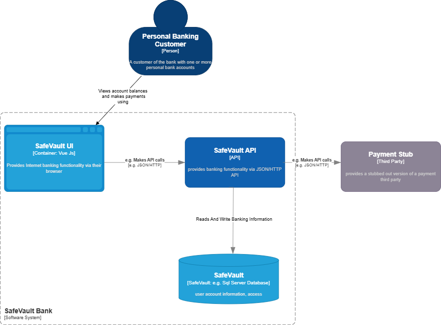

# 🏛️ Architecture Overview

SafeVault is designed using **Clean Architecture principles**, enabling clear separation of concerns, easy testability, and future scalability.

The application acts as a secure banking backend powering the SafeVault SPA. It supports controlled account operations such as viewing balances, internal transfers, airtime purchases, and transaction history.

---

## 🧩 High-Level Architecture

- **Frontend (Vue.js SPA):** Secure Single Page App for customer banking journeys  
- **API (.NET 8):** Business rules, transactional logic, validation  
- **Database (SQL Server):** Account + transaction persistence  
- **Stub Service:** Simulates external integrations like airtime purchases

---

## 🔍 Clean Architecture Layers

| Layer | Responsibility |
|-------|----------------|
| **Domain** | Core business entities + rules + enums |
| **Application** | Use cases, interfaces, business logic |
| **Infrastructure** | EF Core, SQL Server, repository implementations |
| **API** | Controllers, request/response models, authentication |

Each inner layer knows **nothing** about the outside layers — making changes safe and contained.

---

## 📡 Communication Flow

Every action (transfer, purchase, etc.) becomes **a persisted transaction**.
---

## 🔐 Core Security Concepts

✔ A logged-in user only accesses **their own** accounts  
✔ Balances cannot be directly edited — only modified via valid transactions  
✔ Closed accounts block future transactions  
✔ Validation everywhere → business rules are always protected  

---

## 📊 Diagrams

More detailed diagrams can be found here:

📌 C4 Context → `ContextDiagram.md`  
📌 ERD + Relationships → `Database_ERD.md`  
📌 Sequence Diagrams → `SequenceDiagrams.md`  

---

## 🛠️ Future Expandability

SafeVault is built to be upgraded into a full banking system:

- Multi-user auth & role-based access
- Real payment gateways
- Rich fraud & audit logging
- More account types
- Mobile App integration
- Cloud native deployment

The foundation is ready — scale can happen anytime 🚀

