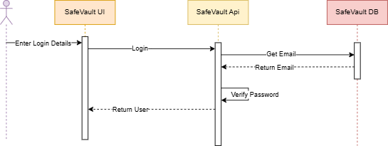
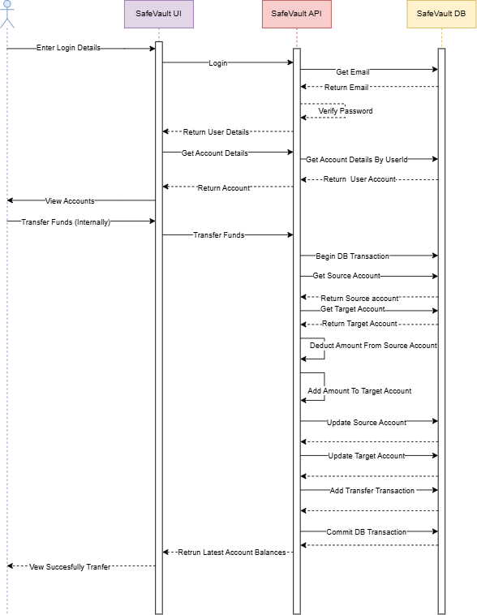
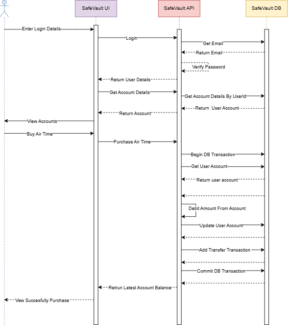

# 🔁 Sequence Diagrams — SafeVault Core User Journeys

This document illustrates the main **end-to-end flows** in SafeVault,
showing interaction between:

- **User (Browser)**
- **Vue.js SPA**
- **.NET API**
- **SQL Server Database**
- **Airtime Stub Service** (external)

Each flow below directly maps to key requirements of the assessment.

---

## 1️⃣ User Login

✔ User authenticated  
✔ Profile 
✔ SPA loads dashboard 

## 2️⃣ View Accounts & Balances

✔ User sees only their own accounts  
✔ Real-time balances from database  

## 3️⃣ Internal Transfer (Current → Savings)

✔ Atomic balance update on both accounts  
✔ Transaction records persisted 

## 4️⃣ Airtime Purchase

✔ Simulated external integration (Stub Service)  
✔ Debit recorded as transaction  
